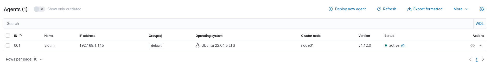

# 🛡️ Home SOC Lab

> **Proyecto en curso** · Fase 1 completada · Fase 2 en desarrollo

Laboratorio de seguridad personal montado en VirtualBox que simula un entorno SOC real: una máquina atacante (Kali Linux), una víctima monitorizada (Ubuntu) y un servidor SIEM (Wazuh) que detecta y alerta sobre los ataques en tiempo real.

---

## Arquitectura

```
[Kali Linux · Atacante]          192.168.1.143
        |
        | nmap · hydra · Metasploit
        ▼
[Ubuntu Server · Víctima]        192.168.1.145
        |
        | Wazuh Agent v4.12.0 · logs en tiempo real
        ▼
[Wazuh Server · SIEM]            192.168.1.146
        |
        | Manager + Indexer + Dashboard
        ▼
[TheHive · SOAR]                 (integración en Fase 2)
```

---

## Stack

| Herramienta | Rol | Estado |
|---|---|---|
| **Wazuh Manager** | SIEM + correlación de eventos | ✅ Activo |
| **Wazuh Indexer** | Almacenamiento e indexación | ✅ Activo |
| **Wazuh Dashboard** | Visualización y alertas | ✅ Activo |
| **Wazuh Agent** | EDR en la VM víctima | ✅ Conectado |
| **TheHive** | SOAR · gestión de incidentes | 🔄 Fase 2 |

---

## Capturas

### Agente activo en Wazuh Dashboard


### Dashboard — Threat Hunting con eventos reales


### IPs del entorno
| Máquina | IP |
|---|---|
| Wazuh Server | 192.168.1.146 |
| Víctima (Ubuntu) | 192.168.1.145 |
| Atacante (Kali) | 192.168.1.143 |

---

## Ataques simulados

Desde la máquina Kali se lanzan ataques reales contra la víctima que Wazuh detecta y registra:

```bash
# Escaneo de puertos
nmap -sS -p- 192.168.1.145

# Fuerza bruta SSH
hydra -l admin -P /usr/share/wordlists/rockyou.txt ssh://192.168.1.145
```

El dashboard muestra en tiempo real los eventos generados:
- **416 eventos** totales detectados
- **190 fallos de autenticación** SSH
- Clasificados por severidad (niveles 1-15)

---

## Errores encontrados y soluciones

Durante la instalación surgieron varios problemas reales. Los documento aquí porque forman parte del aprendizaje:

| # | Error | Causa | Solución |
|---|---|---|---|
| 01 | `wazuh-keystore: No such file or directory` | Ubuntu 26.04 incompatible con Wazuh 4.12 | Reinstalar con Ubuntu 22.04 LTS |
| 02 | `No space left on device` | Disco de 30GB insuficiente para Filebeat | Ampliar disco virtual a 80GB en VirtualBox |
| 03 | `Agent version must be lower or equal to manager version` | Agente 4.14.7 > Servidor 4.12.0 | Instalar `wazuh-agent=4.12.0-1` específicamente |
| 04 | `Duplicate agent name: victim` | Registro previo fallido dejó rastro en el servidor | Limpiar `client.keys` en ambas máquinas y re-registrar |

---

## Roadmap

### ✅ Fase 1 — Completada
- [x] Wazuh Server instalado y funcionando (Ubuntu 22.04)
- [x] Agente Wazuh en VM víctima conectado y activo
- [x] Dashboard accesible y recibiendo eventos reales
- [x] Simulación de ataques SSH detectados correctamente

### 🔄 Fase 2 — En desarrollo
- [ ] Integración TheHive con Wazuh via webhook
- [ ] Creación automática de casos para alertas nivel 12+
- [ ] Dashboard personalizado en Kibana
- [ ] Reglas personalizadas en `local_rules.xml`

### 📋 Fase 3 — Planificada
- [ ] Shuffle SOAR: automatización de respuesta a incidentes
- [ ] Bloqueo automático de IPs atacantes con iptables
- [ ] VM Windows como segunda víctima
- [ ] Script Python de notificación por Telegram/email

---

## Infraestructura

| Componente | Detalle |
|---|---|
| Hipervisor | VirtualBox |
| Red | Adaptador puente |
| OS Servidor | Ubuntu Server 22.04 LTS |
| OS Víctima | Ubuntu Server 22.04 LTS |
| OS Atacante | Kali Linux |
| Wazuh | v4.12.0 |

---

## Autor

**Ignacio González Domínguez** · darkstinx  
[GitHub](https://github.com/darkstinx) · [LinkedIn](https://www.linkedin.com/in/ignacio-gonzalez-dominguez/) · [Portfolio](https://darkstinx.github.io)

---

> Construido mientras hago la transición de DBA en banca a ciberseguridad.  
> Si estás construyendo equipo de seguridad, hablamos.
